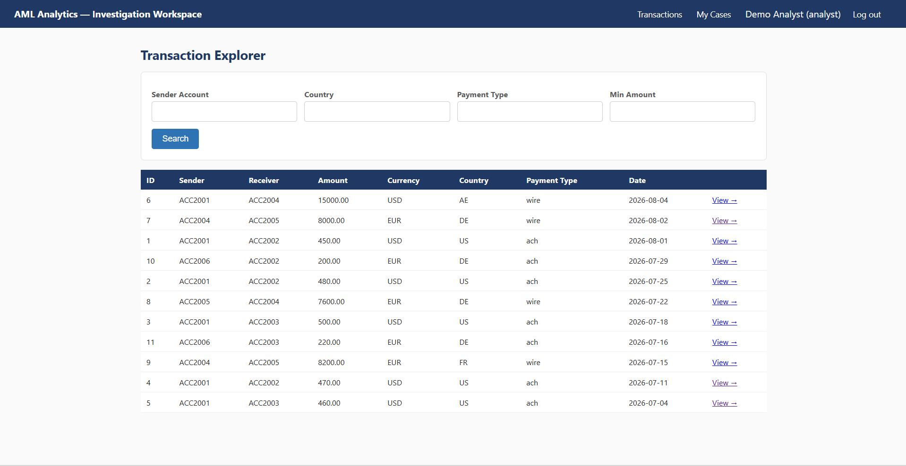
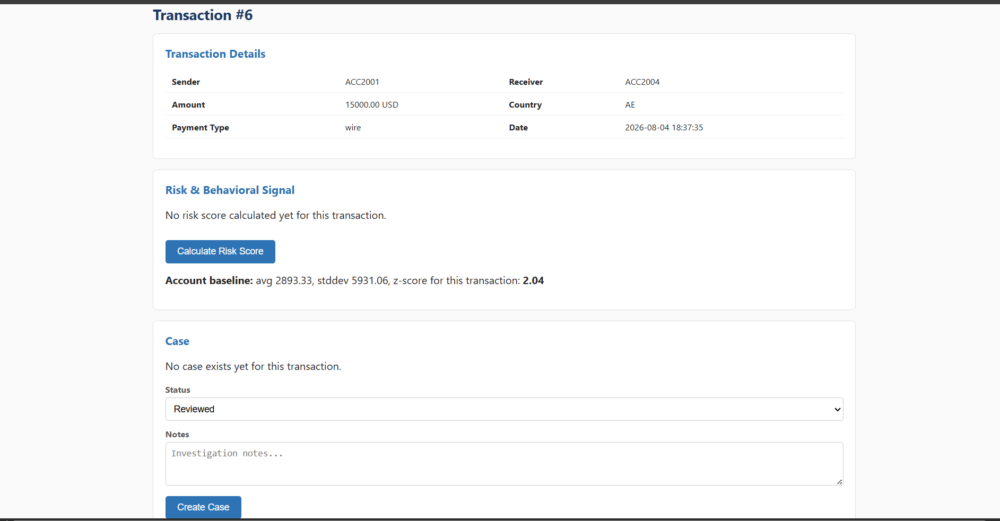

# AML Analytics Platform 

> An end-to-end **Anti-Money Laundering (AML)** analytics platform built using **FastAPI, MySQL, Power BI, and Railway** that combines behavioral transaction analytics, explainable risk scoring, case management, and interactive dashboards.


---

## 🚀 Live Demo

| Service | URL |
|---------|-----|
| 🌐 API | https://aml-analytics-platform-production.up.railway.app |
| 📖 Swagger Docs | https://aml-analytics-platform-production.up.railway.app/docs |
| 💻 Investigation Workspace | https://aml-analytics-platform-production.up.railway.app/app/login |

> **Note:** Railway may take a few seconds to wake up after inactivity.

---

# Project Overview

Traditional AML systems rely heavily on fixed rules (for example, *transactions above a fixed threshold are suspicious*).

AML Analytics Platform is an analyst-focused transaction monitoring and investigation system designed to support Anti-Money Laundering (AML) workflows. It helps compliance analysts identify suspicious transactions using behavioral analytics, calculate explainable risk scores, investigate alerts, manage cases, and visualize trends through interactive Power BI dashboards.

Unlike traditional rule-based monitoring systems, this platform evaluates transactions against an account's historical behavior and peer group patterns, providing analysts with explainable insights rather than relying solely on fixed transaction thresholds.

The platform provides investigators with both:

- a REST API
- a lightweight web-based Investigation Workspace

along with interactive Power BI dashboards.

---

# ✨ Key Features

## 👨‍💼 Analyst Investigation Workspace

- Secure analyst login
- Transaction investigation portal
- Analyst-specific case queue
- Case creation, annotation, and status updates
- Cookie-based authentication for the web workspace

---

## 🔍 Transaction Monitoring

- Search and filter transactions using multiple criteria
- Drill down into transaction details
- Review transaction history alongside behavioral insights
- Monitor suspicious activity from a single investigation interface

---

## 📈 Behavioral Analytics

- Rolling account baseline analysis
- Baseline deviation detection
- Peer-group anomaly detection
- Behavioral profiling using historical transaction patterns

---

## ⚠️ Explainable Risk Scoring

Risk scores are generated using transparent and auditable rules by combining:

- Rule-based indicators
- Baseline deviation
- Peer-group anomaly

Designed as a **decision-support tool** for analysts rather than a black-box prediction model.

---

## 📂 Case Management

- Create investigation cases
- Update investigation status
- Record analyst notes
- Prevent duplicate active cases
- Enforce terminal **Cleared** case state through database business rules

---

## 🔐 Authentication & Security

- JWT authentication for REST APIs
- Cookie-based authentication for the Investigation Workspace
- Role-based authorization (Analyst / Manager)
- Protected write operations
- Passwords secured using bcrypt

---

## 📊 Business Intelligence

Interactive Power BI dashboards for:

- Transaction Monitoring & Risk Overview
- Behavioral & Peer Analytics
- Case Management & Investigation

Power BI connects **directly to MySQL via ODBC**, independently of the FastAPI backend, enabling reporting without introducing API overhead.

```
# 🏗️ Architecture

<p align="center">

</p>

The platform consists of two independent consumers sharing the same MySQL database.

```
                Power BI
                    │
                ODBC Connection
                    │
                    ▼

             MySQL Database
      (Schema + Procedures + Views)

          ▲                     ▲
          │                     │

     FastAPI Backend        Stored Procedures

          │
          ▼

 Investigation Workspace
   (Jinja2 HTML Frontend)
```

---

# 🛠️ Tech Stack

| Layer | Technology |
|--------|------------|
| Backend | FastAPI |
| Language | Python |
| Database | MySQL |
| Authentication | JWT |
| Frontend | Jinja2 Templates |
| Analytics | Power BI |
| Deployment | Railway |
| API Docs | Swagger UI |

---

# 📂 Project Structure

```
AML-Analytics-Platform/

│
├── app/
│   ├── core/
│   ├── repositories/
│   ├── routers/
│   ├── schemas/
│   ├── services/
│   ├── templates/
│   └── web_auth.py
│
├── database/
│   ├── schema/
│   ├── procedures/
│   └── seed/
│
├── dashboards/
│
├── docs/
│
└── requirements.txt
```

---

# ⚙️ Installation

## Clone

```bash
git clone <repository-url>

cd AML-Analytics-Platform
```

## Install

```bash
pip install -r requirements.txt
```

## Configure

Create a `.env`

```env
DB_HOST=...
DB_PORT=3306
DB_USER=...
DB_PASSWORD=...
DB_NAME=aml_analytics

JWT_SECRET_KEY=your_secret_key
```

---

## Database Setup

Execute SQL files in order:

```
database/schema/
```

↓

```
database/procedures/
```

↓

```
database/seed/seed_data.sql
```

---

## Run

```bash
uvicorn app.main:app --reload
```

---

# 📸 Screenshots

## Investigation Workspace

### Login

> 

---

### Transaction Explorer

> 

---

### Transaction Details

> 

---

### Case Queue

>
## Power BI Dashboards

### Dashboard 1

> 

---

### Dashboard 2

> 

---

### Dashboard 3

> 

---

# 🔒 Security

- Passwords hashed using **bcrypt**
- JWT authentication
- Role-based authorization
- Stored procedures validate business rules
- Repository pattern prevents raw business SQL

---

# 🚀 Deployment

Backend and database are deployed on **Railway**.

The application includes:

- REST API
- Swagger Documentation
- Web Investigation Workspace
- Railway MySQL Database

---

# 🔮 Future Improvements

- CSV/PDF report export
- Automated test suite
- Docker support
- CI/CD pipeline
- Email notifications
- Advanced anomaly detection models

---
## 👥 Target Users

This platform is designed for:

- AML Analysts
- Financial Crime Investigation Teams
- Compliance Officers
- AML Managers

It is intended as an internal investigation and decision-support platform rather than a customer-facing banking application.

```
# 👨‍💻 Author

**[gitbyjay25](https://github.com/gitbyjay25)**

Built as a portfolio project demonstrating backend engineering, database design, behavioral analytics, and dashboard development.

---

# ⭐ If you found this project interesting, consider giving it a star!